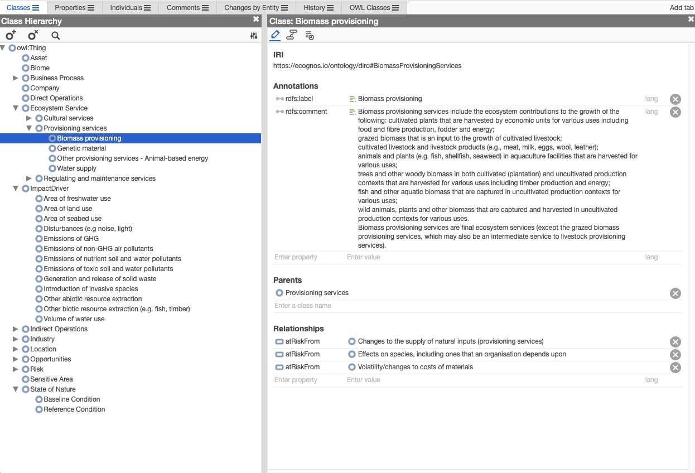

# Documentation

## DIRO_ontology

The TNFD-aligned DIRO ontology is an open, evidence-centric data model for representing nature-related dependencies, impacts, and risk pathways in a way that is traceable, auditable, and suitable for decision-grade TNFD risk assessment.

### 1. Overview

The TNFD-aligned DIRO ontology is an open, evidence-centric data model for representing nature-related dependencies, impacts, and risk pathways in a way that is traceable, auditable, and suitable for decision-grade TNFD risk assessment.

DIRO_ontology provides a shared semantic structure for describing how economic activities interact with ecosystems, how those interactions translate into risk, and how claims about risk can be grounded in underlying evidence. It is designed to support TNFD-aligned analysis where conclusions must be explainable, defensible, and suitable for use in financial and risk decision-making contexts.

DIRO_ontology is intended for use by financial institutions, corporates, data providers, researchers, and tool builders seeking a rigorous way to operationalize nature-related risk beyond high-level screening or proxy-based indicators.

DIRO_ontology is not a scoring model, a valuation framework, or a prescriptive risk methodology. It provides structure and language, not conclusions.

### 2. Why DIRO_ontology Exists

Most current approaches to nature-related risk assessment rely on:

- proxies representing sector or country averages,

- static heatmaps useful for prioritizing geographic or sector focus, or

- metrics for specific businesses, assets or activities that lack necessary context to understand whether impacts or dependencies translate into risk or opportunities for the business. 

While useful for initial screening, these approaches break down where decisions require:

- asset- or project-level reasoning,

- explicit causal pathways,

- linkage to real-world evidence,

- defensibility under audit or regulatory scrutiny.

TNFD's LEAP assessment methodology provides an approach for assessing dependencies, impacts, risk and opportunities, and identifying priority locations, but does not explicitly prescribe a data structure for representing how these elements connect in practice. DIRO_ontology exists to fill that gap by providing a formal, extensible ontology that supports causal reasoning, evidence traceability, and structured expert judgment.

### 3. Alignment with TNFD

DIRO_ontology is explicitly designed to align with TNFD concepts and terminology, particularly the Dependencies–Impacts–Responses–Outcomes (DIRO) framing and the analytical intent of the LEAP approach.

At a high level:

- Dependencies and Impacts are represented as explicit relationships between activities and ecosystems.

Risk emerges from structured pathways linking business processes to dependencies and impacts to state of nature, and outcomes relevant to financial or operational performance.

DIRO_ontology does not reinterpret TNFD guidance or define compliance requirements. It provides a technical foundation that allows TNFD-aligned reasoning to be expressed in a consistent, machine-readable, and auditable form.

### 4. Design Principles

DIRO_ontology is guided by a small number of core principles that shape both its structure and its intended use:

Evidence first
- Claims about dependencies, impacts, or risk should be explicitly linked to underlying evidence.

Causal pathways over flat scores
- Nature-related risk is represented as linked pathways, not as isolated indicators.

Separation of structure from judgment
The ontology defines what can be expressed, not what conclusions must be drawn.

Provenance and traceability
Sources, assumptions, and interpretations are first-class elements, not annotations.

Support for uncertainty and iteration
The model accommodates incomplete, conflicting, or evolving evidence.

Human accountability
DIRO_ontology is designed to support expert reasoning, not replace it.

### 5. Scope: What the Ontology Covers

At a conceptual level, DIRO_ontology provides classes and relationships for representing:

Economic context

- Industry, Company, Assets, Business Processes, Direct/Indirect operations.

Location context

- Geographic location

Ecological context

- Ecosystems (Biomes/ EFGs) and state of nature

Interactions

- Dependencies on ecosystem services

- Impact Drivers driving changes to state of nature

Resulting impacts and state changes

Risk pathways

- Structured chains linking activities, ecosystems, pressures, and outcomes

Evidence

- Reports, studies, observations, spatial data, and other sources supporting claims

Temporal aspects

Timeframes, persistence, and change over time

Together, these elements allow users to represent how and why nature-related risks arise, rather than simply asserting that they exist.

### 6. Non-Scope: What DIRO_ontology Does Not Define

DIRO_ontology intentionally does not prescribe:

- Risk scoring formulas or materiality thresholds

- Quantitative aggregation or weighting logic

- Financial valuation or pricing methods

- Scenario assumptions or probability distributions

- Regulatory interpretations or disclosure judgments

These elements are context-dependent and are expected to be defined by implementers, institutions, or regulators as appropriate.

DIRO_ontology provides a common structure within which such judgments can be made explicit and interrogated.

### 7. Intended Uses

DIRO_ontology is designed to support a range of use cases, including:

- TNFD-aligned nature risk / materiality assessments

- Asset- and project-level due diligence

- Credit, investment, and insurance risk analysis

- Internal risk narratives and committee documentation

- Audit- and regulator-facing justifications

- Research, method development, and tool building

It is suitable for both standalone analysis and integration into larger data platforms or expert systems.

### 8. Example: A Simple Risk Pathway

A typical DIRO risk pathway might link:

- An infrastructure asset or economic activity

- A dependency on a specific ecosystem service (e.g. water regulation)

- One or more pressures affecting that ecosystem (e.g. land-use change, climate stress)

- A resulting impact or state change

- A risk outcome relevant to operational continuity, cost, or asset value 

Concrete examples are provided in the /examples/ directory to illustrate how such pathways can be represented in practice. [coming soon]

### 9. Related Ontologies and External Vocabularies

DIRO_ontology is designed to be used alongside established classification and domain vocabularies. In practice, you may link DIRO entities to:

- **ISIC industry classification** to describe economic activities and sectors.
- **IUCN GET Biomes and EFG** to identify ecological contexts, habitat types, and functional groups.
- **ENCORE materiality scores and business processes** to contextualize dependencies, impacts, and materiality for specific activities.
- **ENVO** to extend to a larger environmental ontology

These resources are not embedded directly in DIRO_ontology. Instead, they can be referenced via IRIs or mapping layers so that DIRO risk pathways remain interoperable while preserving authoritative external definitions.

### 10. Viewing the OWL in Protégé

To load and view DIRO_ontology, you can use Standford's open source viewer: Web Protégé 

To load the OWL file in Protégé:

- Navigate to https://webprotege.stanford.edu/ and create an account
- Create a new project and upload `ontology/tnfd_diro.owl`.
- If prompted, choose to **open from file** (not import from IRI).
- Use the **Classes** or **Entities** tabs to browse terms. 

### 11. Repository Structure

The repository is organized as follows:

/ontology/
Canonical ontology files (e.g. OWL/ Turtle / JSON-LD)

/examples/
Worked examples illustrating common risk pathways {coming soon}

/docs/
Supplementary documentation and explanatory material {coming soon}

Additional validation or shape definitions may be included where relevant. {coming soon}

### 12. Versioning and Stability

DIRO_ontology follows semantic versioning:

- Major versions introduce breaking changes to core terms or relationships

- Minor versions add new terms or extensions without breaking compatibility

- Patch versions address documentation or non-semantic fixes

- Users are encouraged to reference specific versions in production or regulatory contexts.

### 13. Licensing

Ontology files and machine-readable artifacts are licensed under Apache License 2.0

Documentation and explanatory materials are licensed under Creative Commons Attribution 4.0 (CC BY 4.0)

These licenses permit commercial use, modification, and redistribution, subject to their respective terms.

### 14. Governance and Contributions

DIRO_ontology is stewarded by its original authors and maintainers.

See GOVERNANCE.md

Feedback, issues, and contribution proposals are welcome via the repository issue tracker. Contributions are evaluated based on conceptual clarity, alignment with design principles, and long-term maintainability. Not all proposals will be accepted.

### 15. Relationship to Ecognos

DIRO_ontology is an open ontology that can be used independently of any specific software platform.

ecognos.io is one implementation that builds on DIRO_ontology to support evidence-grounded, analyst-led nature risk assessment workflows. Other implementations and extensions are encouraged.

### 16. Citation

If you use DIRO_ontology in academic, policy, or technical work, please cite it as described in CITATION.cff.

### 17. Contact and Next Steps

For questions, feedback, or collaboration inquiries, please open an issue or contact the maintainers directly.
